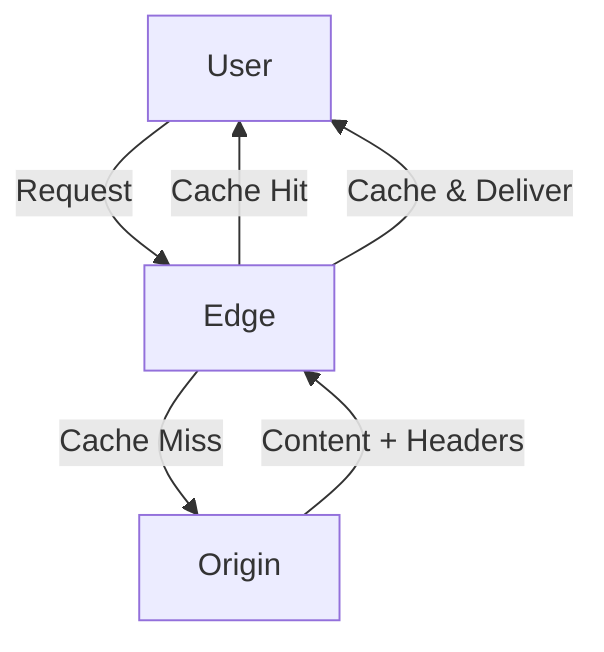

# Content Delivery Network (CDN) Implementation


A distributed CDN solution designed to optimize web content delivery through geographic edge servers and caching.

## Project Overview

This CDN implementation enhances website performance by:
- Reducing latency through geographic distribution
- Improving load times by 50-70%
- Providing redundancy and DDoS protection
- Utilizing Redis caching with automatic content expiration
- Implementing load balancing across edge servers

## Key Components

### 🖥 Origin Server (Port 9090)
- Serves core HTML content via Go + Gorilla Mux
- Pages: 
  - `/main.html` - Home page
  - `/arch.html` - System architecture
  - `/desc.html` - CDN benefits documentation
- Acts as content source for edge servers

### 🌐 Edge Servers
| Location | Port | Features |
|----------|------|----------|
| **US**   | 8080 | - Redis caching<br>- Latency monitoring<br>- Auto-redirect from `/` |
| **EU**   | 8090 | - Cache synchronization<br>- TTL management (10min)<br>- Request metrics |

## Getting Started

### Prerequisites
- Install [Go](https://go.dev/doc/install) (v1.21+)
- Install [Redis](https://redis.io/docs/getting-started/) (v7.0+)
- Install [Docker](https://docs.docker.com/get-docker/) (v24.0+)

### Installation
1. Clone the repository:
    ```bash
    git clone https://github.com/JasminPradhan/ContentDeliveryNetwork.git
    cd ContentDeliveryNetwork
    ```

2. Start the origin server:
    ```bash
    go run origin/main.go
    ```

3. Start the edge servers:
    ```bash
    cd edge-eu
    docker build -t cdn-edge-eu .
    docker run -p 8080:8090 cdn-edge-eu
    ```
    ```bash
    cd edge-us
    docker build -t cdn-edge-us .
    docker run -p 8060:8080 cdn-edge-us
    ```

4. Access the CDN:
    - US Edge Server: `http://localhost:8080`
    - EU Edge Server: `http://localhost:8090`


## System Architecture



## Demonstration

### Cache-Aware Delivery System
- **Automatic Source Selection**: 
  ```http
  GET /main.html HTTP/1.1
  X-Cache-Status: hit (US Edge) | miss (Origin)


